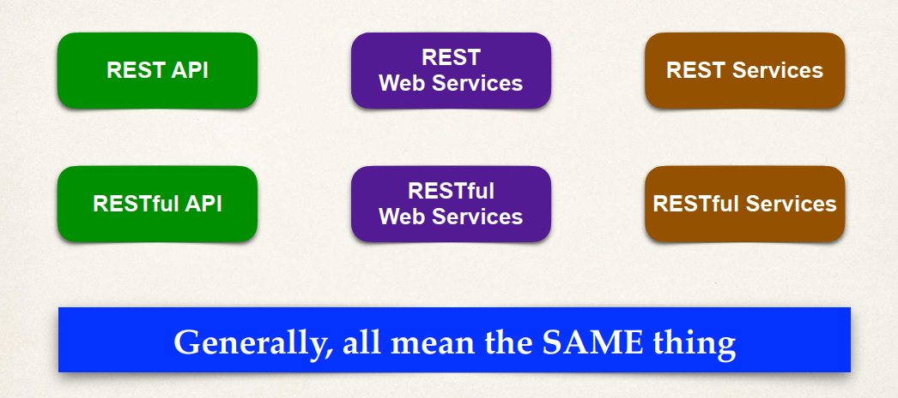

- REST:
    - a set of **architectural constraints**, **not** a **protocol** or a **standard**
    - not tight to just HTTP, can be used with any protocols
- Java POJO
- Data Binding: Serialization/Deserialization
- Jackson:
    - use getter/setter of the POJO
    - default in Spring Start web package
    - automatically convert back and forth between JSON and POJO behind the scene, thanks to Spring Boot (or Spring?)
- Exception Handler: for catching the thrown exception
- Global exception handler with @ControllerAdvice: kind of middleware/filter
- REST anti-patterns
    
- Best Practice
    - Service layer (best practice in combination with DAO)
        - layer for custom business logic
        - integrate data from multiple sources (DAO/repos)
        - Apply @Transactional here is the best practice
    - Spring Data JPA
        - provided `JpaRepository` interface
        - add custom JPQL
        - Query DSL
        - Defining custom methods
        - Provided the @Transactional also, needn’t to manually define.
    - Spring Data REST
        - Just import the package ⇒ no coding require 🙂
        - Scan for JpaRepository ⇒ Automatically expose REST APIs for each (CRRUD)
        - Are HATEOAS compliant:
            - Hypermedia as the Engine of Application State
            - provide info to access REST interfaces (like  meta-data for REST data)
            - Use HAL (Hypertext Application Language) data format
        - Pagination, sorting & searching
        - add custom JPQL
        - Query DSL
        - Do they cover exception handlers?
        - configs
            - Default plural mechanism is simple (just append the ‘s’). Customize by @RepositoryRestResource(path)
            - Pagination via application.properties
            - Sort: pass as path query